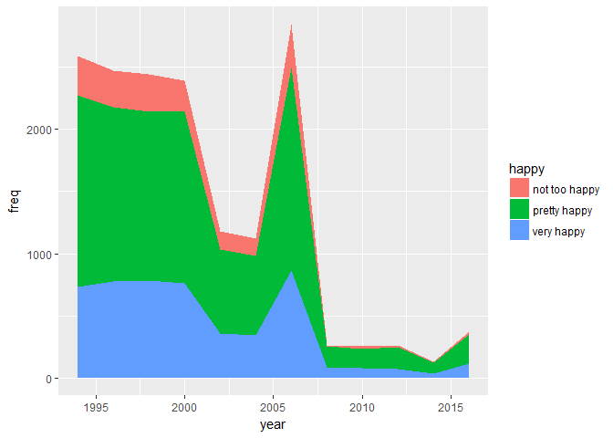
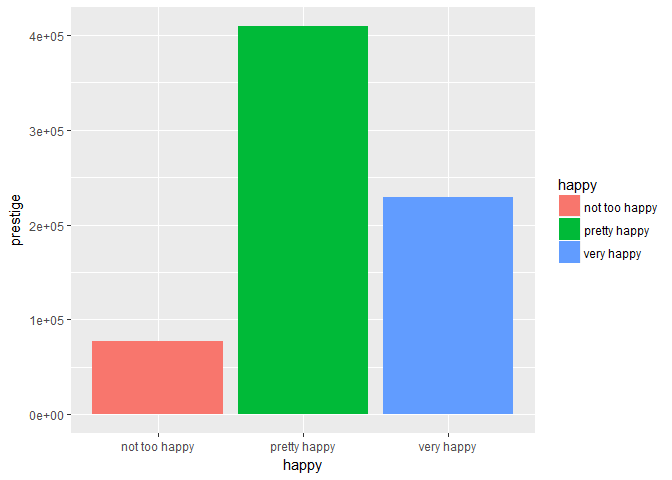
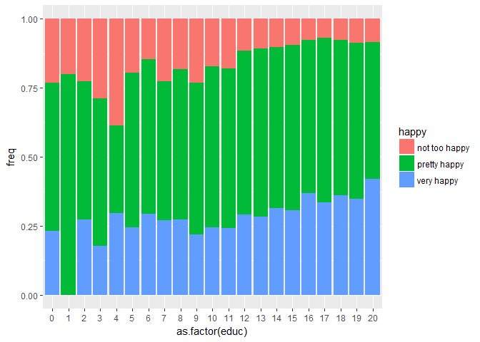
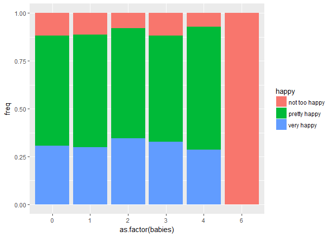
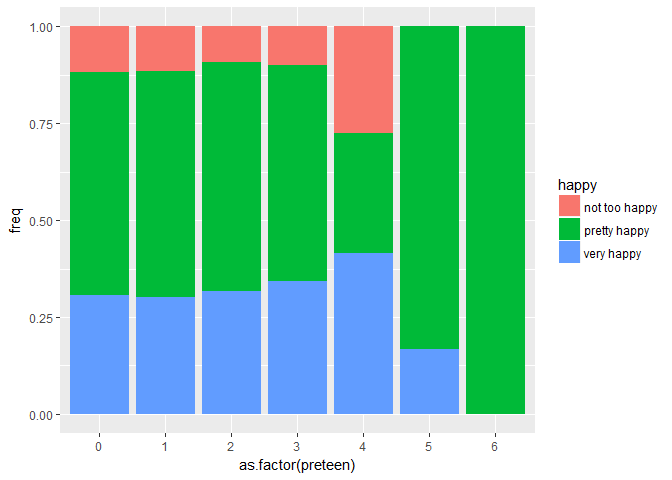
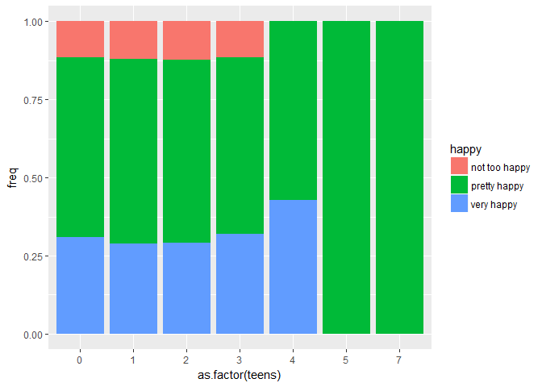
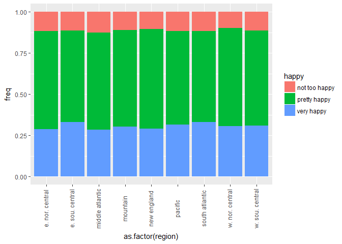
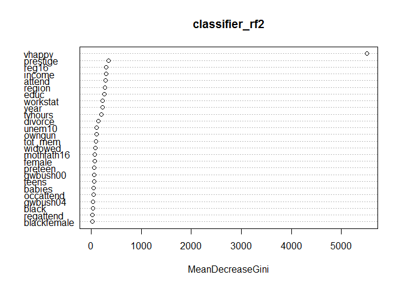

# Happiness-Prediction
ML Hackathon
================
Archit
28 December 2017

``` r
# Loading data and libraries
happy_train<-read.csv("C:/Users/Administrator/Desktop/kaggle/hackaton 2 happy/Happy_train.csv",stringsAsFactors = F)
happy_test<-read.csv("C:/Users/Administrator/Desktop/kaggle/hackaton 2 happy/Happy_test.csv",stringsAsFactors = F)
library(dplyr)
```

    ## 
    ## Attaching package: 'dplyr'

    ## The following objects are masked from 'package:stats':
    ## 
    ##     filter, lag

    ## The following objects are masked from 'package:base':
    ## 
    ##     intersect, setdiff, setequal, union

``` r
library(ggplot2)
```

``` r
# Combining train and test
happy_full <- bind_rows(happy_train,happy_test)
# str(happy_full)
```

``` r
## Percentage of null values
null_val <- round(colSums(is.na(happy_full))*100/nrow(happy_full),2)
null_val <- sort(null_val[null_val>0],decreasing = T)
null_val
```

    ##   gwbush04   gwbush00    divorce    widowed     owngun     unem10 
    ##      88.78      79.97      43.03      35.14      34.13      33.76 
    ##    tvhours      happy     income   prestige     attend  occattend 
    ##      31.18      13.82      12.22       4.98       1.60       1.60 
    ##  regattend     babies    preteen      teens       educ mothfath16 
    ##       1.60       0.61       0.61       0.53       0.25       0.03 
    ##   workstat 
    ##       0.02

``` r
# Filling in missing values

happy_full[is.na(happy_full$gwbush00),"gwbush00"] <- "Not Known"
happy_full[is.na(happy_full$gwbush04),"gwbush04"] <- "Not Known"
happy_full[is.na(happy_full$divorce),"divorce"] <- "Not Known"
happy_full[is.na(happy_full$widowed),"widowed"] <- "Not Known"
happy_full[is.na(happy_full$owngun),"owngun"] <- "Not Known"
happy_full[is.na(happy_full$unem10),"unem10"] <- "Not Known"
median_tv <- median(happy_full$tvhours,na.rm = T)
happy_full[is.na(happy_full$tvhours),"tvhours"] <- median_tv
happy_full[is.na(happy_full$income),"income"] <- "Not Known"
prestige_median <- median(happy_full$prestige,na.rm = T)
happy_full[is.na(happy_full$prestige),"prestige"] <- prestige_median
table(happy_full$babies)
```

    ## 
    ##     0     1     2     3     4     6 
    ## 15986  2001   725   119    15     1

``` r
happy_full[is.na(happy_full$babies),"babies"] <- 0
table(happy_full$preteen)
```

    ## 
    ##     0     1     2     3     4     5     6 
    ## 15520  2134   965   182    34     7     4

``` r
happy_full[is.na(happy_full$preteen),"preteen"] <- 0
table(happy_full$teens)
```

    ## 
    ##     0     1     2     3     4     5     7 
    ## 16207  1981   577    83    10     1     2

``` r
happy_full[is.na(happy_full$teens),"teens"] <- 0
sort(table(happy_full$educ))
```

    ## 
    ##    1    0    2    3    4    5    7    6   19    9   20    8   17   10   18 
    ##    6   31   47   47   48   70  136  167  296  456  481  528  670  687  827 
    ##   15   11   13   14   16   12 
    ##  972  986 1860 2409 2701 5490

``` r
happy_full[is.na(happy_full$educ),"educ"] <- 12
sort(table(happy_full$attend))
```

    ## 
    ##  nrly every week     once a month more thn once wk   lt once a year 
    ##             1034             1318             1405             1518 
    ##     2-3x a month sevrl times a yr      once a year       every week 
    ##             1674             2352             2460             3362 
    ##            never 
    ##             3535

``` r
happy_full[is.na(happy_full$attend),"attend"] <- "never"
happy_full[is.na(happy_full$occattend),"occattend"] <- 0
happy_full[is.na(happy_full$regattend),"regattend"] <- 0
table(happy_full$mothfath16)
```

    ## 
    ##     0     1 
    ##  5830 13126

``` r
happy_full[is.na(happy_full$mothfath16),"mothfath16"] <- 1
sort(table(happy_full$workstat))
```

    ## 
    ## temp not working            other unempl, laid off           school 
    ##              358              440              547              572 
    ## working parttime    keeping house          retired working fulltime 
    ##             2011             2137             2725            10169

``` r
happy_full[is.na(happy_full$workstat),"workstat"] <- "working fulltime"
```

``` r
# converting string to factor

for(i in 1:ncol(happy_full)){
  if(class(happy_full[,i])=="character"){
    happy_full[,i] <- as.factor(happy_full[,i])
  }
}
```

``` r
#Extracting features
happy_full$tot_mem <- happy_full$babies + happy_full$preteen + happy_full$teens +1
```

``` r
#changing s from divorse to yes which had only 1 frequency
happy_full$divorce <- as.character(happy_full$divorce)
happy_full$divorce <- ifelse(happy_full$divorce == "s","yes",happy_full$divorce)
table(happy_full$divorce)
```

    ## 
    ##        no Not Known       yes 
    ##      8227      8160      2575

``` r
happy_full$divorce <- as.factor(happy_full$divorce)
happy_full$happy <- as.factor(happy_full$happy)

colSums(is.na(happy_full))
```

    ##        year    workstat    prestige     divorce     widowed        educ 
    ##           0           0           0           0           0           0 
    ##       reg16      babies     preteen       teens      income      region 
    ##           0           0           0           0           0           0 
    ##      attend      owngun     tvhours      vhappy  mothfath16       black 
    ##           0           0           0           0           0           0 
    ##    gwbush04      female blackfemale    gwbush00   occattend   regattend 
    ##           0           0           0           0           0           0 
    ##         y94         y96         y98         y00         y02         y04 
    ##           0           0           0           0           0           0 
    ##         y06         y08         y10         y12         y14         y16 
    ##           0           0           0           0           0           0 
    ##      unem10       happy     tot_mem 
    ##           0        2621           0

``` r
#splitting back into test and train
happy_train <- happy_full[!is.na(happy_full$happy),]
happy_test <-  happy_full[is.na(happy_full$happy),]
```

EDA
---

``` r
happy_train %>% group_by(year,happy) %>% summarise(freq = n()) %>%
  ggplot(aes(x=year,y= freq,fill = happy))+
  geom_area()
```



``` r
## We can see during the recent years the ratio of people who are not too happy is decreasing

chisq.test(happy_train$workstat,happy_train$happy)
```

    ## 
    ##  Pearson's Chi-squared test
    ## 
    ## data:  happy_train$workstat and happy_train$happy
    ## X-squared = 449.02, df = 14, p-value < 2.2e-16

``` r
## The p value between workstat and happy is less than 0.05. Hence we can conclude that these two factors are dependent

ggplot(happy_train)+
  geom_bar(aes(x=happy,y=prestige,fill = happy),stat = "identity")
```



``` r
## Pretty happy people tend to have a higher prestige score

chisq.test(happy_train$divorce,happy_train$happy)
```

    ## 
    ##  Pearson's Chi-squared test
    ## 
    ## data:  happy_train$divorce and happy_train$happy
    ## X-squared = 754.92, df = 4, p-value < 2.2e-16

``` r
## The p value between divorse and happy is less than 0.05. Hence we can conclude that these two factors are dependent

chisq.test(happy_train$widowed,happy_train$happy)
```

    ## 
    ##  Pearson's Chi-squared test
    ## 
    ## data:  happy_train$widowed and happy_train$happy
    ## X-squared = 325.35, df = 4, p-value < 2.2e-16

``` r
## The p value between widowed and happy is less than 0.05. Hence we can conclude that these two factors are dependent


happy_train %>% group_by(educ,happy) %>% summarise(freq = n()) %>%
  ggplot(aes(x=as.factor(educ),y=freq,fill=happy))+
  geom_bar(stat = "identity",position = "fill")
```



``` r
## We can see that the ratio of not too happy decreases as education level increases

happy_train %>% group_by(babies,happy) %>% summarise(freq = n()) %>%
  ggplot(aes(x=as.factor(babies),y=freq,fill=happy))+
  geom_bar(stat = "identity",position = "fill")
```



``` r
## what an interesting observation, if there are 6  babies in household the person is usually not too happy


happy_train %>% group_by(preteen,happy) %>% summarise(freq = n()) %>%
  ggplot(aes(x=as.factor(preteen),y=freq,fill=happy))+
  geom_bar(stat = "identity",position = "fill")
```



``` r
## This is opposite to number of babies, if there are 6 preteens in family, the person is usually pretty happy


happy_train %>% group_by(teens,happy) %>% summarise(freq = n()) %>%
  ggplot(aes(x=as.factor(teens),y=freq,fill=happy))+
  geom_bar(stat = "identity",position = "fill")
```



``` r
## The result is mroe or less same as pre-teens
```

``` r
happy_train %>% group_by(region,happy) %>% summarise(freq = n()) %>%
  ggplot(aes(x=as.factor(region),y=freq,fill=happy))+
  geom_bar(stat = "identity",position = "fill")+
  theme(axis.text.x = element_text(angle = 90,vjust = 0.3))
```



``` r
# The ratio according to different regions is more or less the same 
```

``` r
library(randomForest)
```

    ## randomForest 4.6-12

    ## Type rfNews() to see new features/changes/bug fixes.

    ## 
    ## Attaching package: 'randomForest'

    ## The following object is masked from 'package:ggplot2':
    ## 
    ##     margin

    ## The following object is masked from 'package:dplyr':
    ## 
    ##     combine

``` r
colSums(is.na(happy_train))
```

    ##        year    workstat    prestige     divorce     widowed        educ 
    ##           0           0           0           0           0           0 
    ##       reg16      babies     preteen       teens      income      region 
    ##           0           0           0           0           0           0 
    ##      attend      owngun     tvhours      vhappy  mothfath16       black 
    ##           0           0           0           0           0           0 
    ##    gwbush04      female blackfemale    gwbush00   occattend   regattend 
    ##           0           0           0           0           0           0 
    ##         y94         y96         y98         y00         y02         y04 
    ##           0           0           0           0           0           0 
    ##         y06         y08         y10         y12         y14         y16 
    ##           0           0           0           0           0           0 
    ##      unem10       happy     tot_mem 
    ##           0           0           0

``` r
## After trying out many models, this model gave the best results
classifier_rf2 <- randomForest(happy ~ year + workstat + prestige + divorce + widowed + educ + reg16 + babies + preteen + teens + income + region + attend + owngun + tvhours + vhappy + mothfath16 + black + gwbush04 + female + blackfemale + gwbush00 + occattend + regattend + unem10 + tot_mem,data = happy_train,ntree = 500)
classifier_rf2
```

    ## 
    ## Call:
    ##  randomForest(formula = happy ~ year + workstat + prestige + divorce +      widowed + educ + reg16 + babies + preteen + teens + income +      region + attend + owngun + tvhours + vhappy + mothfath16 +      black + gwbush04 + female + blackfemale + gwbush00 + occattend +      regattend + unem10 + tot_mem, data = happy_train, ntree = 500) 
    ##                Type of random forest: classification
    ##                      Number of trees: 500
    ## No. of variables tried at each split: 5
    ## 
    ##         OOB estimate of  error rate: 10.96%
    ## Confusion matrix:
    ##               not too happy pretty happy very happy class.error
    ## not too happy           132         1754          0 0.930010604
    ## pretty happy             37         9404          0 0.003919076
    ## very happy                0            0       5014 0.000000000

``` r
varImpPlot(classifier_rf2)
```



``` r
happy_test$pred <- predict(classifier_rf2,happy_test)
happy_test$pred <- as.character(happy_test$pred)
# table(happy_train$happy)
table(happy_test$pred)
```

    ## 
    ## not too happy  pretty happy    very happy 
    ##            31          1813           777

``` r
# happy_test$pred <- ifelse(happy_test$vhappy == 1,"very happy",happy_test$pred)

submission <- as.data.frame(cbind(1:nrow(happy_test),happy_test$pred))
colnames(submission) <- c("Id","Category")
```
